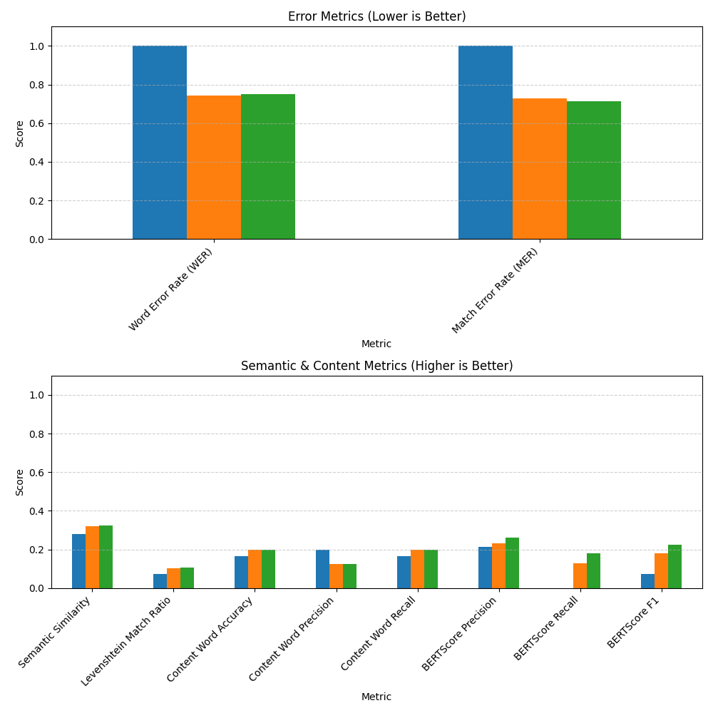

#  Evaluating Whisper on Broca's Aphasic Speech
This project investigates the accuracy of OpenAI's Whisper speech-to-text model on YouTube videos of patients with Broca's aphasia. It compares Whisper-generated transcriptions with manually created ones using both subjective evaluation and objective metrics.

## Project Goals
- Collect openly available video/audio records of aphasic speech
- Extract transcriptions of aphasic speech from YouTube using Whisper
- Manually transcribe the same speech records for comparison
- Identify typical errors Whisper makes with aphasic speech
- Evaluate Whisper's performance using multiple comparison metrics

## 1. Video Selection
**13** openly available videos were used for analysis with the **total duration of 43 minutes**. The samples vary by speaker gender and aphasia severity (mild, moderate, severe), and include both real stroke survivors and educational simulations. Details for each sample can be found [here](data/selected_videos/selected_videos.md).

## 2. Manual Analysis of Transcriptions
The goal of the manual analysis was to evaluate how Whisper handles aphasic speech and identify recurring errors.
#### Transcription Error Types

| **Error Type**          | **Description**                                |
|-------------------------|------------------------------------------------|
| **Omission**            | Word was skipped or left out                   |
| **Insertion**           | Extra word was added that wasn't spoken        |
| **Substitution**        | Incorrect word was used instead of the right one |
| **Fluency Smoothing**   | Grammar was polished unnaturally               |
| **Hallucination**       | Content was invented (not present in speech)   |
| **Repetition Skipping** | Repeated words were dropped                    |
| **Semantic Drift**      | Meaning was changed even if sentence remained fluent |

Comparison tables for each sample with error types and notes can be found here:
* [Manual comparison for Video 1](data/manual_comparison_tables/comparison_1.md)
* [Manual comparison for Video 2](data/manual_comparison_tables/comparison_2.md)
* [Manual comparison for Video 3](data/manual_comparison_tables/comparison_3.md)
* [Manual comparison for Video 4](data/manual_comparison_tables/comparison_4.md)
* [Manual comparison for Video 5](data/manual_comparison_tables/comparison_5.md)
* [Manual comparison for Video 6](data/manual_comparison_tables/comparison_6.md)
* [Manual comparison for Video 7](data/manual_comparison_tables/comparison_7.md)
* [Manual comparison for Video 8](data/manual_comparison_tables/comparison_8.md)
* [Manual comparison for Video 9](data/manual_comparison_tables/comparison_9.md)
* [Manual comparison for Video 10](data/manual_comparison_tables/comparison_10.md)
* [Manual comparison for Video 11](data/manual_comparison_tables/comparison_11.md)
* [Manual comparison for Video 12](data/manual_comparison_tables/comparison_12.md)
* [Manual comparison for Video 13](data/manual_comparison_tables/comparison_13.md)

Overall, Whisper performs well in capturing the key meaning. Even if the speech is fragmented or unclear, it tries to reconstruct it and often does it correctly. 

Most common error types are:
* Missing fillers
* Repetition skipping
* Substitutions

For the task of understanding the patients, Whisper output is very useful. It can translate the impaired speech to the fluent one and therefore be a mediator between the aphasia patient and others, simplifying communication.

However, for the clinical purposes, its tendency to smooth and clean up the speech may not give the realistic representation of speech impairment severity.

## 3. Aphasic Speech Transcription with Whisper

The notebook [whisper_transcription.ipynb](notebooks/whisper_transcription.ipynb) downloads aphasic speech samples from YouTube videos listed in [video_urls.txt](data/selected_videos/video_urls.txt) and transcribes them with Whisper.

1. For each video, the best audio is extracted and saved in .wav format using **yt_dlp** (library to download audio/videos). Audio files are saved in [data/audio folder](data/audio).
2. The **medium-size Whisper model** is used to transcribe each audio file.
3. Each transcription is saved as a .txt file in [data/whisper_transcriptions folder](data/whisper_transcriptions).

## 4. Whisper vs. Manual by Different Metrics

The notebook [manual_vs_whisper.ipynb](notebooks/manual_vs_whisper.ipynb) compares Whisper-generated transcriptions with manual ground truth transcripts using a diverse set of evaluation metrics.

For each video sample, the notebook:

1. Loads raw transcriptions from manual and Whisper outputs.

2. Cleans the texts using normalization (lowercasing, punctuation removal, etc.).

3. Removes filler words like "um", "uh", "eh", etc.

4. Computes evaluation metrics across three versions:

   * Raw (original texts)

   * Cleaned (normalized texts)

   * No Fillers (cleaned with fillers removed)

5. Saves results:

   * Evaluation metrics for each video in [results/metrics](results/metrics);

   * Bar chart visualizations in [results/vis](results/vis).

### Evaluation Metrics

1. **Semantic Similarity** (Cosine Distance using Sentence Transformers) measures how similar the meaning of two texts is, regardless of surface grammar or word order.
2. **Word Error Rate (WER)** measures the literal word-by-word distance between reference and hypothesis.
3. **Levenshtein Ratio** measures how similar are the two texts character by character.
4. **Match Error Rate (MER)** is similar to WER but focuses on the proportion of incorrectly matched characters or tokens. It penalizes hallucinations and substitutions heavily.
5. **Content Word Accuracy / Precision / Recall** evaluate how many *important words* (nouns, verbs, adjectives, adverbs) Whisper captured compared to the manual transcript:
    - **Accuracy** = how many correct content words out of all expected
    - **Precision** = how many content words predicted are correct
    - **Recall** = how many correct content words were retrieved out of those present in the manual text
6. **BERTScore** uses a deep contextual model (BERT) to compare the embeddings of tokens in both sentences:
    - **Precision** = how much of the Whisper output is semantically aligned with the reference
    - **Recall** = how much of the reference meaning is covered by the Whisper output
    - **F1** = harmonic mean of Precision and Recall, giving a balanced overall score

For example, we compare manual transcription: “Um… it’s, it’s hard” and Whisper transcription: “It’s hard”.

1. Semantic similarity: “Um… it’s, it’s hard” turns to vector A and “It’s hard” turns to vector B. The 
Cosine similarity → cos_sim(A, B) will be very high, because semantically the transcriptions are the same.
2. Word Error Rate: “Um… it’s, it’s hard” → ["Um", "it’s", "it’s", "hard"] and “It’s hard” → ["It’s", "hard"].
    

    WER = (Insertions + Deletions + Substitutions) / Words in reference

    WER = (2 insertions) / 4 = 0.5 → 50%
    
So it will be very high, even though the meaning is correct.
    
3. Levenshtein Ratio: 

    Manual:   Um it’s it’s hard

    Whisper:     it’s     hard

    Levenshtein distance = number of edits to make the strings match = 6 edits needed

    Total characters = 17.

    Levenshtein ratio = (Total - Distance) / Total = 17-6/17 = 0.64.

4. **Match Error Rate (MER)**:
    
    Similar to WER here, as two tokens are missing, so ~**0.5**
    
5. **Content Word Accuracy / Precision / Recall**:
    - Content words in manual: {"hard"}
    - Content words in Whisper: {"hard"}
        
    Accuracy, Precision, Recall = **1.0**
        
6. **BERTScore**:
    
    Whisper is missing “Um” and repetition, but keeps the core meaning.
    
    - Precision ~ **0.9** (almost everything it said was correct)
    - Recall ~ **0.7** (missed some info from the reference)
    - F1 ~ **0.8**

### Video 1: Mike Caputo (moderate aphasia) - Evaluation

| Metric                      | Raw   | Cleaned | No Fillers |
|----------------------------|-------|---------|------------|
| **Semantic Similarity**     | 0.727 | 0.84    | 0.924      |
| **Word Error Rate (WER)**   | 0.704 | 0.34    | 0.181      |
| **Levenshtein Match Ratio** | 0.076 | 0.076   | 0.088      |
| **Match Error Rate (MER)**  | 0.704 | 0.34    | 0.180      |
| **Content Word Accuracy**   | 0.794 | 0.875   | 0.853      |
| **Content Word Precision**  | 0.818 | 0.800   | 0.829      |
| **Content Word Recall**     | 0.794 | 0.875   | 0.853      |
| **BERTScore Precision**     | 0.494 | 0.585   | 0.757      |
| **BERTScore Recall**        | 0.155 | 0.347   | 0.746      |
| **BERTScore F1**            | 0.320 | 0.464   | 0.752      |

#### Interpretation
#### 1. **Removing Fillers Greatly Improves Semantic Understanding**

- **Semantic Similarity** rises from `0.727 → 0.924`, showing that Whisper captures the meaning better after noise (like "um", "uh") is removed.
- **BERTScore Recall** leaps from `0.155 → 0.746`, indicating Whisper retained more *relevant* semantic units than expected once filler noise is filtered out.

#### 2. **Cleaning Text Reduces Literal Errors (WER/MER)**

- **Word Error Rate** drops drastically from `0.704` to `0.340` and then to `0.181`, showing Whisper performed much better when minor formatting (e.g., punctuation, repeated words) was cleaned.
- This suggests that many of Whisper’s “errors” are due to disfluencies common in aphasic speech — which, if not medically necessary to retain, distort metrics.

#### 3. **Levenshtein Ratio Stays Low**

- Stays between `0.076–0.088`, indicating that **character-level similarity remains low** across all versions.
- This reinforces that Whisper doesn't produce surface-level matches but often semantically paraphrases, which is why semantic metrics (BERT, cosine similarity) tell a fuller story.

#### 4. **Content Word Accuracy**

- Content Word Accuracy is already high across all versions (around 0.79–0.88), meaning Whisper does a good job at capturing the important words.

#### Whisper understands what is being said, especially when filler words are excluded. ####

### Video 2: Kent (severe aphasia) - Evaluation

| Metric                      | Raw   | Cleaned | No Fillers |
|----------------------------|-------|---------|------------|
| **Semantic Similarity**     | 0.280 | 0.322   | 0.325      |
| **Word Error Rate (WER)**   | 1.000 | 0.744   | 0.750      |
| **Levenshtein Match Ratio** | 0.074 | 0.104   | 0.106      |
| **Match Error Rate (MER)**  | 1.000 | 0.727   | 0.714      |
| **Content Word Accuracy**   | 0.167 | 0.200   | 0.200      |
| **Content Word Precision**  | 0.200 | 0.125   | 0.125      |
| **Content Word Recall**     | 0.167 | 0.200   | 0.200      |
| **BERTScore Precision**     | 0.215 | 0.232   | 0.262      |
| **BERTScore Recall**        | -0.060| 0.129   | 0.182      |
| **BERTScore F1**            | 0.075 | 0.182   | 0.223      |

#### Performance drop due to severity of aphasia
| Metric                    | Video 1 *(Moderate)* | Video 2 *(Severe)* |
| ------------------------- | -------------------- | ------------------ |
| **Semantic Similarity**   | 0.924 (No Fillers)   | 0.325 (No Fillers) |
| **WER**                   | 0.181                | 0.744              |
| **Content Word Accuracy** | 0.875                | 0.200              |
| **BERTScore F1**          | 0.752                | 0.223              |

In severe aphasia, errors are not just about disfluency.

Removing fillers barely improves metrics, which means that the core message is misinterpreted, not just cluttered.

Semantic metrics like BERTScore Recall and Content Word Precision remain very low, suggesting hallucinations or misalignment in generated text.